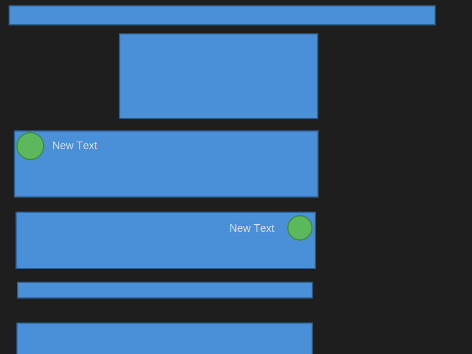

# Untitled Design



## Données Techniques (JSON)

```json
{
  "title": "Untitled Design",
  "canvasWidth": 800,
  "canvasHeight": 600,
  "backgroundColor": "#1e1e1e",
  "elements": [
    {
      "$type": "rectangle",
      "width": 722.0080108642578,
      "height": 32.369476318359375,
      "fill": "#4a90d9",
      "stroke": "#2d5a87",
      "strokeWidth": 2,
      "cornerRadius": 0,
      "elementType": "rectangle",
      "id": "37659822-4619-403e-8bff-e91e52ec4cfb",
      "x": 15.542171478271484,
      "y": 9.767066955566406,
      "rotation": 0,
      "name": "Toolbar",
      "description": "Include a square Logo placeholder and a responsive menu. List ob buttons on desktop and a dropdown on mobile. The Menu item get highliter/selected when the user scroll"
    },
    {
      "$type": "rectangle",
      "width": 335.8232879638672,
      "height": 143.5341339111328,
      "fill": "#4a90d9",
      "stroke": "#2d5a87",
      "strokeWidth": 2,
      "cornerRadius": 0,
      "elementType": "rectangle",
      "id": "a85d76ac-10f2-4d1e-add1-776420c431ff",
      "x": 202.56625366210938,
      "y": 57.329315185546875,
      "rotation": 0,
      "name": "Logo Banner",
      "description": "Place holder for the Logo \u0026 Name Banner. Max 50% width on desktop, 100% on mobile. Center horizontaly. "
    },
    {
      "$type": "rectangle",
      "width": 514.4578094482422,
      "height": 112.04818725585938,
      "fill": "#4a90d9",
      "stroke": "#2d5a87",
      "strokeWidth": 2,
      "cornerRadius": 0,
      "elementType": "rectangle",
      "id": "6b50d620-cbb8-438b-bb3d-9fd478ab22e3",
      "x": 24.56224822998047,
      "y": 221.8433837890625,
      "rotation": 0,
      "name": "Article 1",
      "description": "Article about a feature of the project"
    },
    {
      "$type": "circle",
      "radius": 22.650604248046875,
      "fill": "#5cb85c",
      "stroke": "#3d8b3d",
      "strokeWidth": 2,
      "elementType": "circle",
      "id": "1c7785cf-d57b-4b97-8a54-a83ee03cf259",
      "x": 51.437744140625,
      "y": 247.63453674316406,
      "rotation": 0,
      "name": "Icon",
      "description": "Article icon"
    },
    {
      "$type": "rectangle",
      "width": 507.38958740234375,
      "height": 95.34136962890625,
      "fill": "#4a90d9",
      "stroke": "#2d5a87",
      "strokeWidth": 2,
      "cornerRadius": 0,
      "elementType": "rectangle",
      "id": "f3dead06-2778-4128-b8f5-d61f9b6be5d8",
      "x": 27.33333969116211,
      "y": 359.6747131347656,
      "rotation": 0,
      "name": "Article 2",
      "description": "An other article about some features"
    },
    {
      "$type": "text",
      "content": "New Text",
      "fontSize": 18,
      "fontFamily": "Arial, sans-serif",
      "fill": "#e0e0e0",
      "fontWeight": "normal",
      "elementType": "text",
      "id": "093cb878-3954-43cf-8fe5-bd90269490bd",
      "x": 88.52207946777344,
      "y": 252.7188720703125,
      "rotation": 0,
      "name": "Article title",
      "description": "New text element"
    },
    {
      "$type": "circle",
      "radius": 20.401611328125,
      "fill": "#5cb85c",
      "stroke": "#3d8b3d",
      "strokeWidth": 2,
      "elementType": "circle",
      "id": "25967217-c948-4900-8919-2aed6a7e2e11",
      "x": 508.293212890625,
      "y": 386.2690734863281,
      "rotation": 0,
      "name": "Article 2 icon",
      "description": "New circle"
    },
    {
      "$type": "text",
      "content": "New Text",
      "fontSize": 18,
      "fontFamily": "Arial, sans-serif",
      "fill": "#e0e0e0",
      "fontWeight": "normal",
      "elementType": "text",
      "id": "be3099d1-6311-4d3d-9f0d-fdfc3b1a68be",
      "x": 388.6586151123047,
      "y": 393.01607513427734,
      "rotation": 0,
      "name": "Article 2 title",
      "description": "New text element"
    },
    {
      "$type": "rectangle",
      "width": 500.96385192871094,
      "height": 125.54217529296875,
      "fill": "#4a90d9",
      "stroke": "#2d5a87",
      "strokeWidth": 2,
      "cornerRadius": 0,
      "elementType": "rectangle",
      "id": "8e440402-7c66-4635-a6f2-480678199d01",
      "x": 28.55419158935547,
      "y": 547.5501251220703,
      "rotation": 0,
      "name": "Getting Started",
      "description": "Describe hot to use and setup Kazo Desing"
    },
    {
      "$type": "rectangle",
      "width": 499.6787414550781,
      "height": 26.586334228515625,
      "fill": "#4a90d9",
      "stroke": "#2d5a87",
      "strokeWidth": 2,
      "cornerRadius": 0,
      "elementType": "rectangle",
      "id": "6e5f4107-da5e-497d-b896-c2b86d61336b",
      "x": 29.931720733642578,
      "y": 478.5582580566406,
      "rotation": 0,
      "name": "... Others Articles ...",
      "description": "New rectangle"
    }
  ],
  "prompt": null,
  "createdAt": "2026-01-14T00:16:58.043Z",
  "modifiedAt": "2026-01-14T00:26:01.029Z"
}
```
