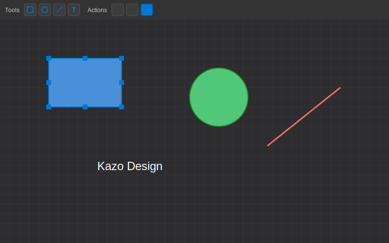
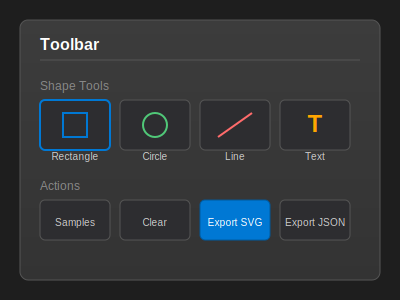
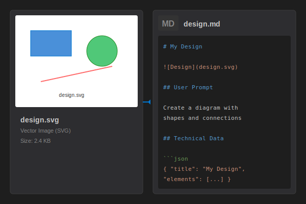

# Kazo Design MCP


[](https://marketplace.visualstudio.com/items?itemName=KazoMedia.kazo-design-mcp)
[](https://desing.kazo.ca/)
[](LICENSE)
[](https://dotnet.microsoft.com/)
[](https://dotnet.microsoft.com/apps/aspnet/web-apps/blazor)

A Visual Studio Code extension that helps you communicate your design intentions to AI assistants like GitHub Copilot. Create quick sketches, mockups, or wireframes to visually express what you want the AI to build. Powered by a high-performance C# rendering engine (.NET 10 Blazor WebAssembly).

🌐 **Website:** [https://desing.kazo.ca/](https://desing.kazo.ca/)



## Workflow

When working with an AI assistant (like GitHub Copilot), use Kazo Design MCP to better communicate your vision:

1. **Request**: Ask the AI to create something (e.g., a web page, a component, a UI layout)
2. **Sketch**: The AI invites you to create a visual sketch of what you have in mind
3. **Draw**: Open the SVG editor and draw your idea using simple shapes
4. **Confirm**: Click the "Confirm & Return to AI" button when your sketch is ready
5. **Save** (Optional): Choose to save your sketch with a custom name and location
6. **Generate**: The AI uses your sketch to better understand and implement your request

## Features

### 🎨 Quick Sketch Editor
Create rapid mockups and wireframes directly within VS Code. The editor provides a simple, intuitive interface for expressing your design ideas to AI assistants.

### 🧠 AI Communication Tool (MCP)
The Model Context Protocol (MCP) integration enables seamless communication between you and your AI assistant. Your sketches become visual context that helps the AI understand exactly what you want.

### 🔧 Shape Tools
- **Rectangle**: Create boxes for layouts, containers, or buttons
- **Circle**: Add circular elements for icons, avatars, or decorations
- **Line**: Draw connections, separators, or pointing elements
- **Text**: Add labels to explain different parts of your sketch



### ✅ Confirm & Return
When your sketch is ready:
- Click the "Confirm & Return to AI" button
- Optionally save your sketch to a file
- The AI receives your visual context and can proceed with your request

### 💾 Smart Export Format
When saving a design, two files are created automatically:
- **SVG file**: The vector image for use in documentation, websites, or further editing
- **Markdown file**: Companion documentation containing:
  - Title and preview image
  - Original prompt or description
  - Technical data in JSON format for version control and future editing



### 🎯 Interactive Canvas
- **Drag & Drop**: Move elements freely on the canvas
- **Selection**: Click to select elements for editing or deletion
- **Grid**: Visual grid overlay for precise alignment
- **Zoom**: Ctrl+scroll to zoom in/out
- **Pan**: Scroll to pan around the canvas

### 🔌 VS Code Integration
- Native VS Code commands and keyboard shortcuts
- Webview panel with full VS Code theming support
- State persistence across VS Code sessions

## Installation

### From VS Code Marketplace

1. Open VS Code
2. Go to Extensions (`Ctrl+Shift+X` / `Cmd+Shift+X`)
3. Search for "Kazo Design MCP"
4. Click **Install**

### From VSIX File

1. Download the `.vsix` file from [Releases](https://github.com/werddomain/Kazo-Desing-MCP/releases)
2. In VS Code, go to Extensions
3. Click the `...` menu and select "Install from VSIX..."
4. Select the downloaded file

## Usage

### Opening the Editor

1. Open the Command Palette (`Ctrl+Shift+P` / `Cmd+Shift+P`)
2. Type "Kazo Design" and select one of:
   - `Kazo Design: Open Editor` - Opens the diagram editor
   - `Kazo Design: New Design` - Creates a new design

### Creating Shapes

1. Click a shape tool in the toolbar (Rectangle, Circle, Line, or Text)
2. The shape will be added to the canvas at a random position
3. Drag shapes to reposition them
4. Click on a shape to select it
5. Use the Delete button to remove selected shapes

### Exporting Your Design

1. Click the **Export SVG** button (blue) to download the SVG file
2. Click the **Export JSON** button to download the design data
3. Use the save functionality to create both SVG and Markdown files

### Commands

| Command | Description |
|---------|-------------|
| `Kazo Design: Open Editor` | Opens the diagram editor panel |
| `Kazo Design: New Design` | Creates a new blank design |

## MCP Tools for AI Assistants

Kazo Design MCP provides a set of tools that AI assistants (like GitHub Copilot) can use to interact with users. These tools enable rich, visual communication between users and AI.

### Available MCP Tools

| Tool | Reference Name | Description |
|------|----------------|-------------|
| **Request Design Sketch** | `#kazo_sketch` | Ask the user to create a visual sketch or mockup. Opens the Kazo Design editor and waits for the user to complete their drawing. |
| **Select Option** | `#kazo_select` | Present a list of options for the user to choose from. Can optionally allow replying with a sketch. |
| **Request Text Input** | `#kazo_text` | Ask the user to enter custom text via an input dialog. |
| **Select File** | `#kazo_file` | Ask the user to select a file or folder from their system. |
| **Confirm Action** | `#kazo_confirm` | Ask the user to confirm or decline an action (Yes/No dialog). |
| **Get Capabilities** | `#kazo_capabilities` | Get information about Kazo Design features and available tools. |

### Tool Details

#### 🎨 kazo_request_sketch

Ask the user to create a visual sketch to communicate their design idea.

**Parameters:**
- `title` (optional): A short title for the sketch (e.g., "Login Page Layout")
- `prompt` (optional): Instructions for what the user should sketch

**Returns:** SVG and JSON representation of the completed sketch.

**Example usage in AI prompt:**
> "I need to understand your design idea. Please use #kazo_sketch to draw what you have in mind."

#### 📋 kazo_select_option

Present options for the user to choose from, with optional sketch reply.

**Parameters:**
- `title` (required): The question or title to display
- `options` (required): Array of options to choose from
- `canSelectMany` (optional): Allow multiple selections
- `allowSketch` (optional): Add "Reply with sketch" option
- `sketchPrompt` (optional): Instructions if user chooses to sketch

**Returns:** Selected option(s) or sketch data.

#### ✏️ kazo_request_text

Request free-form text input from the user.

**Parameters:**
- `title` (required): Title of the input dialog
- `prompt` (optional): Additional instructions
- `placeholder` (optional): Placeholder text
- `defaultValue` (optional): Pre-filled default value
- `password` (optional): Hide input for sensitive data

**Returns:** The entered text.

#### 📁 kazo_select_file

Ask user to select files or folders.

**Parameters:**
- `title` (required): Title of the file picker
- `canSelectMany` (optional): Allow multiple file selection
- `canSelectFolders` (optional): Select folders instead of files
- `filters` (optional): File type filters (e.g., `{ "Images": ["png", "jpg"] }`)
- `defaultUri` (optional): Default folder path

**Returns:** Selected file path(s).

#### ✅ kazo_confirm_action

Ask for Yes/No confirmation.

**Parameters:**
- `title` (required): Short title for the confirmation
- `message` (required): The confirmation question
- `confirmLabel` (optional): Custom label for confirm button (default: "Yes")
- `cancelLabel` (optional): Custom label for cancel button (default: "No")

**Returns:** Whether user confirmed or declined.

#### ℹ️ kazo_get_capabilities

Get information about Kazo Design capabilities.

**Parameters:** None

**Returns:** JSON with available shapes, features, output formats, and tools.

## Building from Source

### Prerequisites

- [.NET 10 SDK](https://dotnet.microsoft.com/download/dotnet/10.0)
- [Node.js 18+](https://nodejs.org/)
- [Visual Studio Code](https://code.visualstudio.com/)

### Build Steps

1. **Clone the repository**
   ```bash
   git clone https://github.com/werddomain/Kazo-Desing-MCP.git
   cd Kazo-Desing-MCP
   ```

2. **Build the Blazor UI**
   ```bash
   cd src/KazoDesign.Editor
   dotnet restore
   dotnet publish -c Release -o ../../vscode-extension/media/ui
   ```

3. **Build the VS Code extension**
   ```bash
   cd vscode-extension
   npm install
   npm run compile
   ```

4. **Run in development mode**
   - Open the project in VS Code
   - Press `F5` to launch the Extension Development Host

## Technical Notes: Blazor in VS Code WebView

Running Blazor WebAssembly inside a VS Code WebView requires several patches because the WebView uses a custom URL scheme (`vscode-webview://`) that .NET's `System.Uri` cannot parse.

### The Problem

When Blazor starts, it reads the browser's URL to initialize `NavigationManager`. The `vscode-webview://` scheme causes a `net_uri_BadHostName` exception because .NET's URI parser doesn't recognize it as a valid scheme.

### The Solution

We implement multiple layers of fixes:

#### 1. JavaScript Navigation Interceptor (index.html)

Before Blazor loads, we patch `Blazor._internal.navigationManager` to return fake HTTP URLs:

```javascript
// Intercept Blazor's NavigationManager initialization
window._blazorNavigationInterceptor = {
    getBaseURI: function() { return 'https://localhost/'; },
    getLocationHref: function() { return 'https://localhost/'; }
};

// Patch after Blazor script loads but before start
if (window.Blazor && window.Blazor._internal && window.Blazor._internal.navigationManager) {
    window.Blazor._internal.navigationManager = {
        ...window.Blazor._internal.navigationManager,
        getBaseURI: () => 'https://localhost/',
        getLocationHref: () => 'https://localhost/'
    };
}
```

#### 2. FakeNavigationManager (C#)

A custom `NavigationManager` implementation that ignores real URLs:

```csharp
// Services/FakeNavigationManager.cs
public class FakeNavigationManager : NavigationManager, IHostEnvironmentNavigationManager
{
    public FakeNavigationManager()
    {
        Initialize("https://localhost/", "https://localhost/");
    }

    void IHostEnvironmentNavigationManager.Initialize(string baseUri, string uri)
    {
        // Ignore real URIs, use fake ones
        Initialize("https://localhost/", "https://localhost/");
    }

    protected override void NavigateToCore(string uri, NavigationOptions options)
    {
        // Navigation not supported in WebView
    }
}
```

Register in `Program.cs`:
```csharp
builder.Services.AddScoped<NavigationManager, FakeNavigationManager>();
```

#### 3. Removed Router and HeadOutlet

These components internally use `NavigationManager` and can trigger URI parsing before our patches take effect:

```csharp
// Program.cs - HeadOutlet removed
builder.RootComponents.Add<App>("#app");
// builder.RootComponents.Add<HeadOutlet>("head::after"); // REMOVED
```

```razor
@* App.razor - Router replaced with direct rendering *@
@using KazoDesign.Editor.Layout
@using KazoDesign.Editor.Pages

<MainLayout>
    <Home />
</MainLayout>
```

#### 4. Placeholder HttpClient BaseAddress

The default `HttpClient` registration uses `builder.HostEnvironment.BaseAddress` which also fails:

```csharp
// Use placeholder URL instead of HostEnvironment.BaseAddress
builder.Services.AddScoped(sp => new HttpClient { 
    BaseAddress = new Uri("https://localhost/") 
});
```

### Debugging Tips

1. **Open WebView DevTools**: `Ctrl+Shift+P` → "Developer: Open Webview Developer Tools"
2. **Check Output Channel**: View → Output → "Kazo Design"
3. **Error Panel**: A debug panel appears in the WebView when errors occur

### Project Structure

```
Kazo-Desing-MCP/
├── src/
│   └── KazoDesign.Editor/       # Blazor WebAssembly UI
│       ├── Components/          # Razor components (toolbar, canvas, shapes)
│       ├── Models/              # Data models for design elements
│       ├── Pages/               # Main page components
│       ├── Services/            # Design service and state management
│       └── wwwroot/             # Static assets and JavaScript
├── vscode-extension/            # VS Code extension
│   ├── src/                     # TypeScript source
│   ├── media/                   # UI assets (Blazor build output)
│   └── package.json             # Extension manifest
├── screenshots/                 # Documentation images
└── KazoDesign.sln              # Visual Studio solution file
```

## Publishing

See [PUBLISH.md](PUBLISH.md) for detailed instructions on publishing the extension to the VS Code Marketplace.

## File Format

### Design JSON Structure

```json
{
  "id": "uuid",
  "title": "My Design",
  "canvasWidth": 800,
  "canvasHeight": 600,
  "backgroundColor": "#2d2d30",
  "elements": [
    {
      "type": "rectangle",
      "x": 100,
      "y": 100,
      "width": 150,
      "height": 100,
      "fill": "#4a90d9",
      "stroke": "#0078d4"
    }
  ],
  "createdAt": "2024-01-01T00:00:00Z",
  "modifiedAt": "2024-01-01T00:00:00Z"
}
```

### Supported Shape Types

| Type | Properties |
|------|------------|
| `rectangle` | x, y, width, height, fill, stroke, cornerRadius |
| `circle` | x, y, radius, fill, stroke |
| `line` | x, y, x2, y2, stroke, strokeWidth |
| `text` | x, y, content, fontSize, fill, fontFamily |
| `image` | x, y, width, height, href |

## Contributing

Contributions are welcome! Please feel free to submit a Pull Request.

1. Fork the repository
2. Create your feature branch (`git checkout -b feature/amazing-feature`)
3. Commit your changes (`git commit -m 'Add some amazing feature'`)
4. Push to the branch (`git push origin feature/amazing-feature`)
5. Open a Pull Request

## License

This project is licensed under the BSD 2-Clause License - see the [LICENSE](LICENSE) file for details.

## Acknowledgments

- Built with [Blazor WebAssembly](https://dotnet.microsoft.com/apps/aspnet/web-apps/blazor)
- Powered by [VS Code Extension API](https://code.visualstudio.com/api)
- SVG rendering and manipulation

## Support

If you encounter any issues or have feature requests, please [open an issue](https://github.com/werddomain/Kazo-Desing-MCP/issues) on GitHub.
